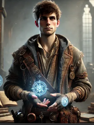
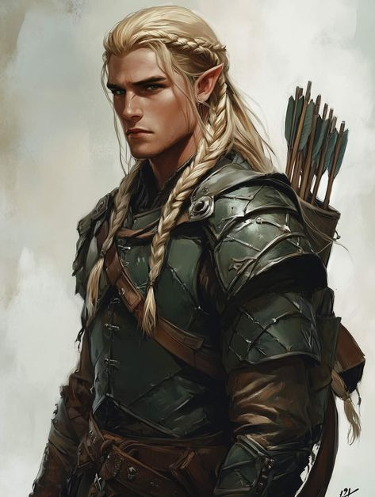
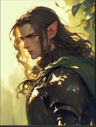

# Characters

## Players
### Kaelen Roth

The story begins on the University Campus where Kaelen invites everyone to have an introductory meeting before their expedition into a forgotten teleportation magician's lab in the Kingdom of Anor.

This expedition is crucial to Kaelen as he is on the brink of failing college due to his failed, yet ambitious, personal projects. His groundbreaking experiments always seem to run out of "funding." Kaelen is in his fourth year of his Bachelor's in Applied Magic.

---

### Darwin Sagehorn

**Introduction**  
Darwin is the son of Duke Markus Sagehorn, one of the leaders in the campaign against the beastmen in the south. These beastmen have been recently dubbed the "Green Wave," given their greenish appearance and relentless waves against the kingdom of Corinthar.

**Personality**  
Darwin embodies "Noblesse oblige," striving to help anyone in trouble. Humble compared to his peers, who flaunt their noble birthright, Darwin's practical approach to problems enables him to ask the right questions and gain a deeper understanding of complex situations.

---

### Anduril Wallace

These disgraced and exiled elf brothers once enjoyed the company of the greatest elf [missing detail]. However, due to an incident [missing detail], they now attempt to regain their reputation.

---

### Edmund Wallace

Further details about Edmund are not yet included.

---

## NPCs

### Professor Baelin
Professor Baelin is the head of the Department of Applied Magic and Professor of the Course
of Magic Combat and survival. He is an Immortal human like goat creature with a long beard and immense power. He is the one who summons Kaelen to his office to discuss the expedition to the ruins of the teleportation mage's laboratory.

### Duke Marlowe Greystone: The Reluctant Steward

Duke Marlowe Greystone was not born into power but thrust into it by fate. The youngest son of a minor noble family, his early years were spent as a squire during the **War of the Sorcerer-King**, where he earned a reputation for resourcefulness and calm under pressure. His service caught the eye of Duke Harland Greystone, a distant cousin and ruler of Oldhaven, who named Marlowe his heir after the tragic deaths of his own children during the Orc Wars.
When Duke Harland succumbed to illness, Marlowe inherited the title during one of the city's darkest periods. Refugees flooded Oldhaven's gates as orcish hordes razed the countryside, and the ongoing **war between Cast and Anor** left the city isolated, with allies too preoccupied to send aid.
Marlowe's leadership is marked by pragmatism and empathy. He has worked tirelessly to forge fragile alliances with local mercenary bands and nearby towns, believing cooperation is the key to survival. Under his direction, the **Oldhaven Academy of Tactics and Lore** was reopened, reflecting his conviction that knowledge and strategy are as vital as swords in the city’s defense.
Despite his efforts, his reign has not been without controversy. Strict rationing policies and reliance on mercenaries have drawn ire from the city's nobility, who accuse him of neglecting their interests in favor of the common folk. At the same time, his refusal to align Oldhaven with either side in the **Cast-Anor conflict** has fueled rumors that he harbors sympathies for one faction or the other.
Through it all, Duke Marlowe remains steadfast in his mission: to preserve Oldhaven as a sanctuary for all who seek refuge, even as the city teeters on the brink of crisis.
