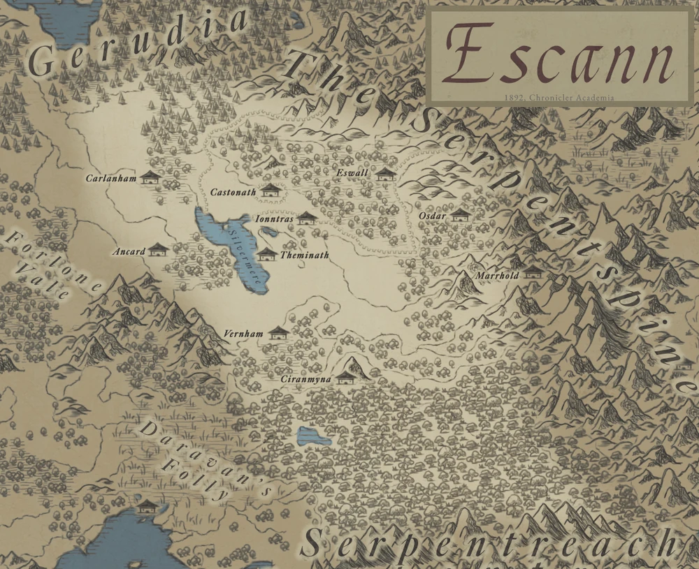
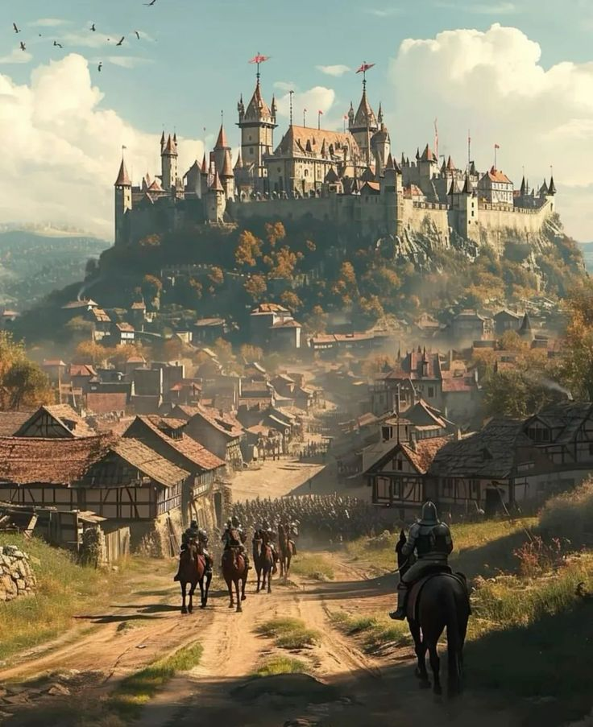

# Places
## Regions

**Escann** (Old Castanorian for **Eastern Cannor**) is the easternmost region of **Cannor**. It is bordered to its east by the **Serpentspine Mountains**, to its north by **Gerudia**, to its south by **Bulwar**, 
and to its west by **Western Cannor**. **Escann** has historically been divided into three major regions **Inner**, **West**, and **South Castanor**, which are so named due to their having been the domain of **Castanor** and its successor, **Black Castanor**. 
Beginning in the **Age of Witch Kings**, cartographers, politicians and commonfolk alike have reincluded the **Deepwoods** as part of the region after its reintegration at the end of the **Greentide**.

---

With the final collapse of **Black Castanor** came an end to a fifteen century legacy. Emerging from the chaos and disorder were a number of smaller states stemming from either historical provinces or were founded by veterans of the **War the Sorcerer-King**. 
Such examples are the **Kingdom of Acengard**, a state alleged to have been under the influence of the **Infernal Court**, the **The Genrasi City State** ruled by hero **Alex Roth** who slew the **Sorcerer-King Nichmer**, causing a civil war in the kingdom of Castanor resulting in two warring state named Cast led by the old monerchy and Anor led by the nobility.

---

During this period, there was a general aversion to direct warfare, an effort to avoid the cataclysms that led to the fall of **Castanor**. Instead, many conflicts were resolved by tournaments, knightly duels and controlled small scale battles. Over the course of this period,
these were codified into what is now known as the **Trial by Chivalry**.

---

## Countries

### **Cast**
The Kingdom of Cast emerged as a successor state to the Castanorian Empire following the War of the Sorcerer-King. After **Alex Roth**, a legendary hero, slew the Sorcerer-King of Castanor, the empire fractured, and Cast became the stronghold of the original royal family, claiming legitimacy as the rightful heir to the empire’s legacy.

Centered in the fertile heartlands of Inner Castanor, Cast clung to traditions of divine right and imperial order. Its capital, **Brightspire**, symbolized the old empire’s grandeur, featuring the **Grand Castanorian Cathedral**, where kings were crowned.

During the civil war with Anor, Cast maintained a rigid hierarchy, emphasizing the monarchy’s central authority. However, internal dissent and noble rivalries weakened its unity. The kingdom’s disciplined knights and the renowned **Castanorian Vanguard** upheld its military strength, fighting to restore the empire’s glory.

---

### **Anor**
The Kingdom of Anor arose alongside Cast, forming a rival successor state after the Sorcerer-King’s fall. Rejecting the monarchy’s central authority, Anor was founded by powerful nobles advocating decentralized governance, claiming they were the true stewards of Castanorian ideals.

The capital, **Goldvale**, became a thriving trade hub, home to the **Golden Exchange** and the **Hall of Lords**, where Anor’s nobility shaped policy. Anor’s leaders promoted shared power and regional autonomy, directly challenging Cast’s claim to imperial legitimacy.

Anor relied heavily on mercenaries and adventurers, with alliances strengthening its flexibility on the battlefield. However, inconsistent loyalty among its forces often undermined its campaigns. The rivalry with Cast became a struggle not just for power, but for defining Castanor’s legacy—imperial monarchy versus noble autonomy.

### **Corintar**

Founded shortly after **Corin's** death at the **Battle of Castonath**, the **Corintar order** was at first, simply one of many adventuring groups attempting to reclaim **Escann** from **The Greentide**.
With the evangelizing efforts of **Dominic of Gallowspeak** and **Lothane**, **Corintar** became the center first of **Corin's** ascension to the **Regent Court pantheon** and later, 
when **Castellos's** death was revealed during the **Age of Unraveling**, the center of the new **Corinite faith**.

---
## Cities

### **Oldhaven**

Located near the **Gate of Escann**, Oldhaven is a city of ancient origins now burdened by the challenges of war and survival. It is ruled by **Duke Marlowe Greystone**, whose authority is confined to the city and its immediate surroundings. Despite his limited power, Duke Greystone's leadership is critical as Oldhaven faces a growing influx of refugees fleeing orc invasions, compounding an already dire food shortage.

The city is divided into three distinct districts:

- **Highspire Quarter**: Home to **Skyward Keep**, the Duke's seat of power, and the **Oldhaven Academy of Tactics and Lore**, preserving the traditions of Escann.
- **Riversmeet**: A bustling commercial hub along the **Alderflow River**, now overwhelmed by overcrowding and scarcity of resources.
- **The Hollow**: A historic and shadowy district known for its artisans and rumors of hidden cults.

Despite its struggles, Oldhaven remains the host of the famed **Trial by Chivalry Tournaments**, held in the **Plains of Valor** just outside its walls. These tournaments offer fleeting unity and hope in a city grappling with the effects of the ongoing **war between Cast and Anor**.

### **Generasi**

The city of **Generasi** has developed significantly over the last **1000 years**. While still familiar in some ways—with landmarks,
like the **Roth bakeries** and the **university**—you'll now find that the entire city has been teleported to the top of the **Kargloth** a mountain in the **Serpent Spine**.